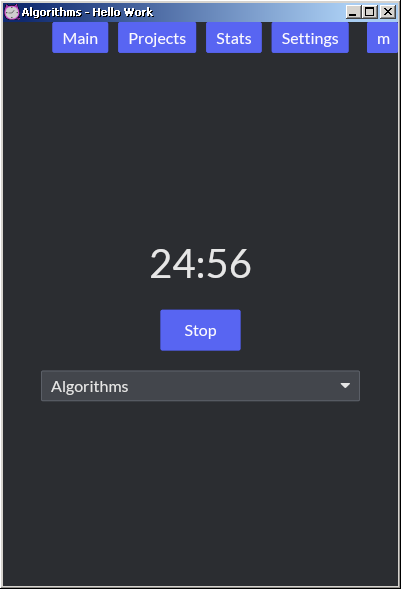
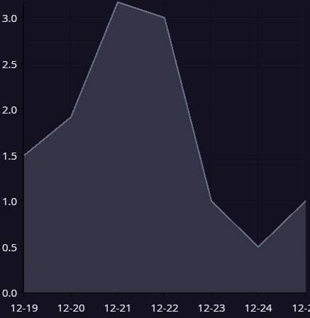
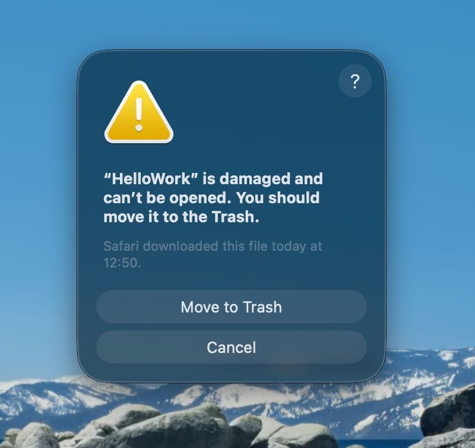

# Hello Work 

It's a pomodoro timer, project manager, to-do list. A time tracker? Yeah, if you can quantize all your work into pomodoro sessions.



You can add projects and an arbitrary depth of sub-projects. The total hours spent on each project will be displayed in the projects tab, aggregated with its sub-projects.

There's a mini-window to always stay on top of your screen to remind you that a session is going.


You can see your total hours for the last week (and soon™ other stats too).



## FAQ

### Does it save my session when I click "Stop"?

Not currently, no. This is to encourage finishing what you started. It does however, undermine the time tracking promise a bit.

### Mac tells me this is trash



As this is an unsigned app, you will have to remove the quarantine after installation with the following command in the terminal.

```sh
xattr -d com.apple.quarantine /Applications/HelloWork.app
```

### The mini window does not stay on top under Wayland

Yeah that might happen due to unresolved Wayland limitations, use a window rule from your desktop.

### The UI elements are too large under X11

Either set `Xft.dpi: 96` in `~/.Xresources`, or set `WINIT_X11_SCALE_FACTOR=1`. See [this](https://github.com/rust-windowing/winit/issues/2231).

# Credits

[MonkeyType](https://github.com/monkeytypegame/monkeytype/tree/master/frontend/static/themes) for an excellent source of simple color schemes.
